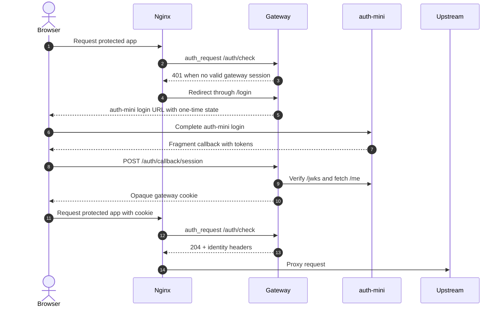

# auth-mini-gateway Docs

auth-mini-gateway is a small Rust/SQLite front-auth adapter for putting nginx-protected apps behind auth-mini login.

It does not replace auth-mini. It lets nginx ask a first-party gateway whether a browser request should reach a protected upstream.

## Good Fit

Use this gateway when you want:

- auth-mini login in front of an app that cannot verify auth-mini tokens itself.
- nginx `auth_request` enforcement for HTTP and WebSocket traffic.
- server-side storage of auth-mini access and refresh tokens.
- browser sessions represented only by opaque, signed, HttpOnly cookies.
- a single active gateway instance with durable SQLite WAL persistence.
- simple email/user-id allowlists independent of the IdP authentication method.

## Not Trying To Include

This gateway intentionally does not provide:

- auth-mini's authentication core, users, credentials, OTP, Passkey, or signing-key storage.
- OIDC or OAuth provider behavior.
- RBAC, organizations, tenants, admin UI, or audit products.
- direct upstream proxying from the gateway; nginx remains the proxy.
- multi-active gateway instances sharing one SQLite database.
- cloud-provider-specific deployment manifests.

## Request Flow

## Quick Start For Production Planning

1. Deploy auth-mini first and configure its public issuer.
2. Decide the protected public origin, for example `https://app.example.com`.
3. Decide the auth-mini public origin, for example `https://auth.example.com`.
4. Configure nginx as the only public entry to the protected upstream.
5. Run one active gateway instance with a persistent SQLite volume.
6. Set `COOKIE_SECURE=true` behind HTTPS and use a strong `GATEWAY_COOKIE_SECRET`.
7. Verify login, refresh, logout, allowlist denial, and WebSocket behavior before rollout.

## Documentation

- [Production deployment](production-deployment.md)

## Repository References

- Root README: `../README.md`
- Example nginx config: `../examples/nginx.conf`
- Example Docker Compose topology: `../examples/docker-compose.yml`
- Real auth-mini E2E harness: `../scripts/e2e-real-auth-mini.sh`
