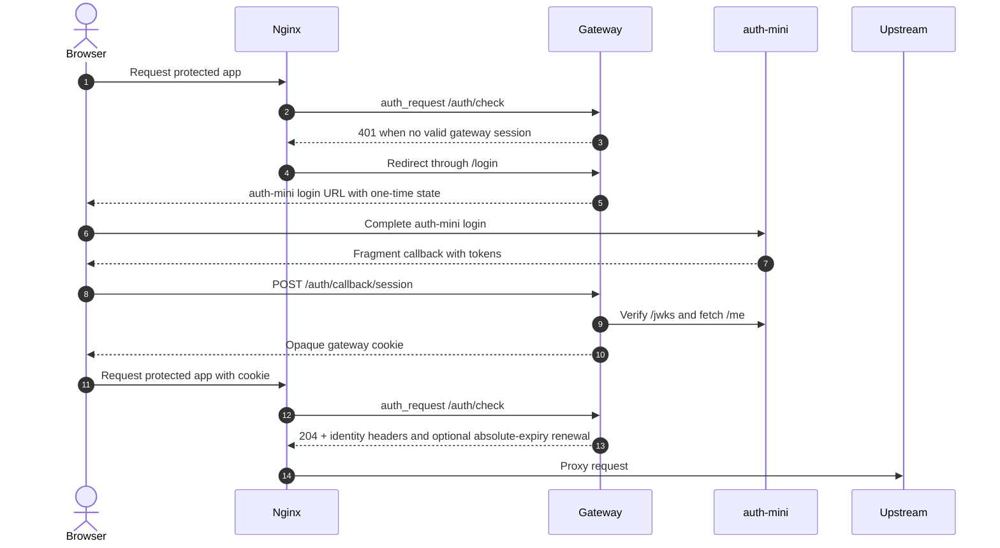

# auth-mini-gateway Docs

auth-mini-gateway is a small Rust/SQLite authentication gateway for putting
apps behind auth-mini login. It can be an nginx `auth_request` adapter or a
single fixed-upstream streaming proxy.

It does not replace auth-mini. It lets nginx ask a first-party gateway whether a browser request should reach a protected upstream.

## Good Fit

Use this gateway when you want:

- auth-mini login in front of an app that cannot verify auth-mini tokens itself.
- nginx `auth_request` enforcement, or direct authenticated HTTP/SSE/WebSocket
  proxying to one configured upstream.
- server-side storage of auth-mini access and refresh tokens.
- browser sessions represented only by opaque, signed, HttpOnly cookies.
- a single active gateway instance with durable SQLite WAL persistence.
- simple email/user-id allowlists independent of the IdP authentication method.

## Not Trying To Include

This gateway intentionally does not provide:

- auth-mini's authentication core, users, credentials, OTP, Passkey, or signing-key storage.
- OIDC or OAuth provider behavior.
- RBAC, organizations, tenants, admin UI, or audit products.
- multiple upstreams, host/path routing, or user-selected destinations.
- multi-active gateway instances sharing one SQLite database.
- cloud-provider-specific deployment manifests.

## Request Flow

## Quick Start For Production Planning

1. Deploy auth-mini first and configure its public issuer.
2. Decide the protected public origin, for example `https://app.example.com`.
3. Decide the auth-mini public origin, for example `https://auth.example.com`.
4. Choose adapter mode (node-local nginx proxies the app) or fixed-upstream
   proxy mode (FRP maps the gateway and the app remains loopback-only).
5. Run one active gateway instance with a persistent SQLite volume.
6. Set `COOKIE_SECURE=true` behind HTTPS and use a strong `GATEWAY_COOKIE_SECRET`.
7. Verify login, refresh, logout, allowlist denial, and WebSocket behavior before rollout.

Proxy-mode production uses one fixed chain: Acorn nginx `:443` -> Acorn
loopback frps `18081` -> Axiom gateway `7780` -> loopback OpenCode `4096`.
Use the checked `nginx-proxy.conf`, `frps.toml`, `frpc.toml`, and systemd
examples below; do not expose `7780` or `4096` publicly.

## Session and failure model

- New sessions have a 7-day idle timeout and a hard 30-day lifetime from callback creation.
- Only successful protected-request authorization advances idle time, at most once per hour.
- Access refresh is request-driven; it does not require browser background execution.
- A rotated token is stored as identity `Pending` before `/me` is fetched. Pending sessions fail closed until a fresh matching identity is available.
- Temporary or uncertain refresh and identity failures return `503` without clearing the browser session.
- Local logout/expiry is terminal. Remote revocation is trusted only for the refresh endpoint's exact `session_invalidated` or `session_superseded` response.
- `/me` failures, including `401 invalid_access_token`, never revoke a session.

Silent SSO is currently **unsupported** by the pinned auth-mini capability evidence. It is not implemented or simulated in the gateway.

## Documentation

- [Production deployment](production-deployment.md)
- [Silent SSO capability gate](silent-sso-capability.md)

## Repository References

- Root README: `../README.md`
- Example nginx config: `../examples/nginx.conf`
- Acorn proxy nginx config: `../examples/nginx-proxy.conf`
- Maintenance-only old-binary nginx config: `../examples/nginx-proxy-rollback.conf`
- FRP server/client configs: `../examples/frps.toml`, `../examples/frpc.toml`
- systemd service with `LimitNOFILE=4096`: `../examples/auth-mini-gateway.service`
- Example Docker Compose topology: `../examples/docker-compose.yml`
- Real auth-mini E2E harness: `../scripts/e2e-real-auth-mini.sh`
- Direct proxy-mode harness: `../scripts/e2e-proxy-mode.sh`
- Adapter/proxy mode-switch drill: `../scripts/e2e-mode-switch.sh`
- Actual pre-change binary compatibility harness: `../scripts/e2e-old-binary-compat.sh`
- WAL-consistent backup/restore drill: `../scripts/e2e-wal-backup-restore.sh`
